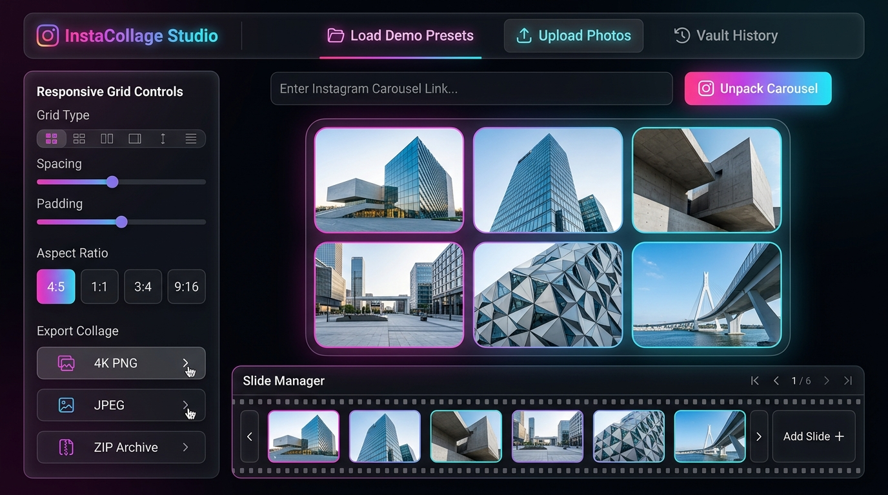
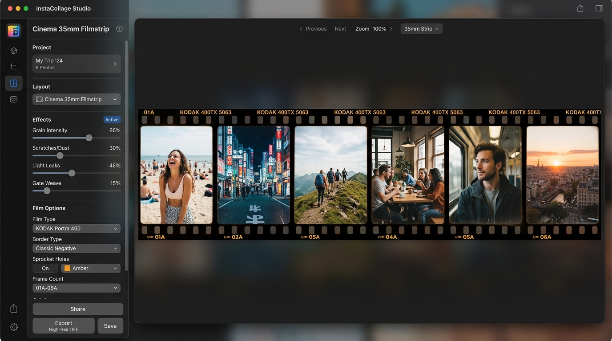
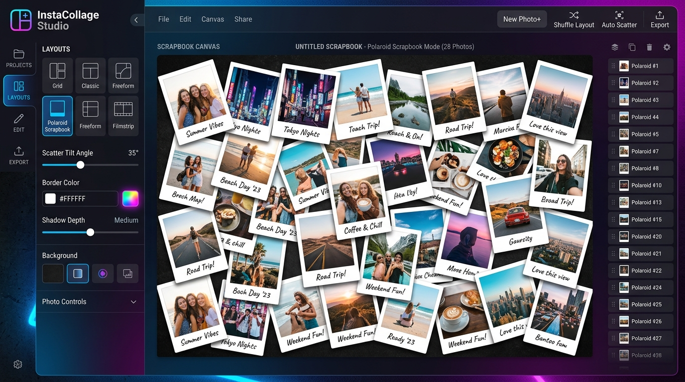
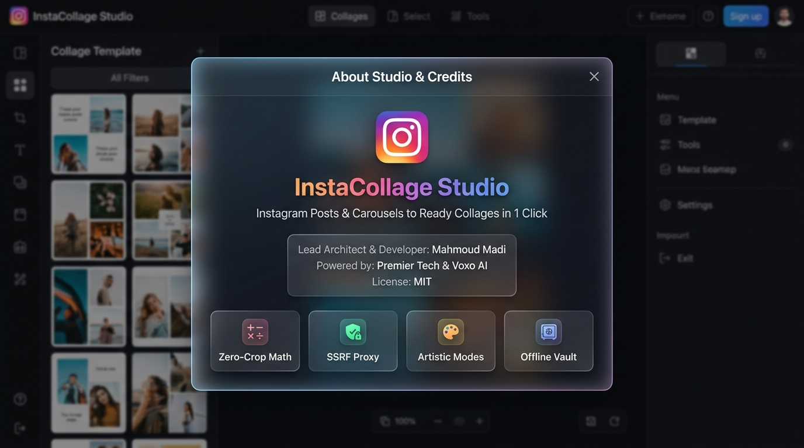

<div align="center">

  

  # 📸 InstaCollage — Instagram Posts & Carousels to Ready Collages in 1 Click
  
  **Turn any Instagram post or multi-slide carousel into stunning, ready-to-share high-DPI collages, moodboards, and filmstrips in one single click.**
  
  [](LICENSE)
  [](https://nodejs.org)
  [](public/manifest.json)
  [](CONTRIBUTING.md)
  [](.github/workflows/ci.yml)

  <p align="center">
    <strong>Developed by <a href="https://github.com/mahmoud-madi">Mahmoud Madi</a></strong> • <strong>Powered by Premier Tech & Voxo AI</strong>
  </p>

  <p align="center">
    <a href="#-quick-start">Quick Start</a> •
    <a href="#-key-features">Key Features</a> •
    <a href="#-artistic-layout-modes">Artistic Modes</a> •
    <a href="#-architecture">Architecture</a> •
    <a href="#-docker-deployment">Docker</a> •
    <a href="#-api-reference">API Reference</a> •
    <a href="#-credits--license">Credits & License</a>
  </p>

</div>

---

## 🌟 What is InstaCollage?

**InstaCollage** is an open-source, production-grade Progressive Web App (PWA) and backend API built to unpack every individual high-resolution photo and video from public **Instagram Carousel & Post** links and transform them into breathtaking, ultra-customizable photo collages, polaroid moodboards, and cinematic filmstrips in real time.

Built with **HTML5 Canvas 2D API**, **Vanilla ES6+ JavaScript**, **IndexedDB persistence**, and an **SSRF-hardened media proxy**, InstaCollage delivers instantaneous client-side rendering with zero browser canvas tainting, zero loss of fidelity, and zero cropping.

---

## 🚀 Key Features

- 🔄 **Universal Multi-Tier Scraper**: Unpacks carousels from public Instagram URLs without requiring user tokens or login sessions.
- 📐 **Zero-Crop Multi-Aspect Geometry Engine**: Auto-adapts canvas tiles to original $3:4$, $4:5$, $1:1$, and $9:16$ portrait photos without cutting off tops/bottoms or adding unwanted letterbox bars.
- 🛡️ **SSRF-Hardened CORS Media Proxy**: Safe upstream streaming with loopback and private network blacklisting (`127.0.0.1`, `10.0.0.0/8`, `192.168.0.0/16`, `169.254.169.254`).
- 🎨 **Artistic Collage Modes**:
  - **Standard Matrix Grid**: 1 to 6 columns/rows with dynamic tile gaps and corner radii.
  - **Polaroid Scrapbook**: Organic tilted photo cards with realistic shadows and customizable handwritten chin notes.
  - **Cinema 35mm Filmstrip**: Realistic Kodak/Fuji film sprockets, frame counters, and date stamps.
  - **Masonry Pin Wall**: Pinterest-style dynamic flowing photo streams.
- 🎛️ **Live Visual Tuning**: Center-crop vs. contain fit modes, instant 90° rotation, drag-and-drop slide reordering, drop shadows, and color grading filters (Vivid, Vintage 90s, Kodak Sepia, Cyber Mono, Dramatic Noir, Pastel Fade).
- 💾 **Offline IndexedDB Carousel Vault**: Auto-saves unpacked carousels locally so you can browse, edit, and re-export past carousels anytime without an internet connection.
- 📦 **Bulk ZIP Archiver**: Multi-threaded in-memory archiving for downloading all raw original slides in a single `.zip` file.
- 📱 **Progressive Web App (PWA)**: Installable on Windows, macOS, Android, and iOS with Web Share Target support.

---

## 📸 Visual Showcase

<div align="center">
  <h3>✨ Responsive Matrix Grid & Studio Interface</h3>
  
  <br/><br/>
  
  <table width="100%">
    <tr>
      <td width="50%" align="center">
        <h4>🎞️ Cinema 35mm Filmstrip Mode</h4>
        
      </td>
      <td width="50%" align="center">
        <h4>📷 Polaroid Scrapbook Mode</h4>
        
      </td>
    </tr>
    <tr>
      <td colspan="2" align="center">
        <h4>ℹ️ About Studio & Developer Info</h4>
        
      </td>
    </tr>
  </table>
</div>

---

## 🎭 Artistic Layout Modes

| Mode | Visual Style | Best Used For |
| :--- | :--- | :--- |
| **Grid Matrix** | Clean, symmetric grid with custom gaps, radii, and backdrop blur. | Social media carousels, aesthetic grids, portfolio overviews. |
| **Polaroid Scrapbook** | Organic tilted photo prints with realistic soft drop shadows. | Vacation highlights, memory collages, wedding albums. |
| **Cinema Filmstrip** | Continuous 35mm negative strip with sprockets and frame counter. | Sequential stories, cinematic portraits, analog photography. |
| **Masonry Wall** | Variable-height column flow that balances aspect ratios. | Mixed landscape and portrait photo galleries. |

---

## ⚡ Quick Start

### Prerequisites
- [Node.js](https://nodejs.org/) v18.0.0 or higher
- npm or yarn

### 1. Clone & Install
```bash
git clone https://github.com/mahmoud-madi/instagram-carousel-to-collage.git
cd instagram-carousel-to-collage
npm install
```

### 2. Launch Development Server
```bash
npm run dev
```

Open **`http://localhost:3300`** in your browser.

---

## 🐳 Docker Deployment

Run InstaCollage Studio in a secure, lightweight container:

### Using Docker Compose (Recommended)
```bash
docker compose up -d
```

### Using Plain Docker
```bash
docker build -t instacollage-studio .
docker run -d -p 3300:3300 --name instacollage instacollage-studio
```

Open **`http://localhost:3300`** in your browser.

---

## 🏗️ Architecture & Data Flow

```
[ Instagram Carousel URL ]
            |
            v
[ Express Scraper Engine ] --> [ SSR HTML Parser + Token Resolver ]
            |
            v
[ Clean Uncropped Slide URLs ]
            |
            v
[ SSRF-Hardened Proxy Stream ] --> [ Client Canvas Compositor ]
                                                |
                               +----------------+----------------+
                               |                                 |
                               v                                 v
                     [ Interactive 2D Canvas ]        [ Local IndexedDB Vault ]
                               |
                               v
                     [ 4K PNG / JPEG / ZIP ]
```

---

## 📡 API Reference

### `POST /api/extract`
Unpacks a public Instagram carousel post URL into slide metadata.

**Request:**
```json
{
  "url": "https://www.instagram.com/p/Db-QrfGjDFd/"
}
```

**Response:**
```json
{
  "success": true,
  "source": "live_instagram",
  "data": {
    "shortcode": "Db-QrfGjDFd",
    "author": {
      "username": "brandbrainy",
      "fullName": "Brand Brainy",
      "isVerified": true
    },
    "caption": "Minimalist branding and packaging design showcase...",
    "likesCount": "12.4K",
    "postedAt": "August 14, 2026",
    "slides": [
      {
        "slideIndex": 0,
        "originalUrl": "https://scontent.cdninstagram.com/v/t51...",
        "thumbnailUrl": "https://scontent.cdninstagram.com/v/t51...",
        "aspectRatio": 0.75,
        "isVideo": false,
        "title": "Slide 1"
      }
    ]
  }
}
```

---

### `GET /api/proxy`
Streams remote media with CORS authorization and SSRF protection.

**Query Parameters:**
- `url` (required): URL-encoded image URL.

---

### `POST /api/download-zip`
Packages an array of slide URLs into an in-memory downloadable `.zip` archive.

**Request:**
```json
{
  "shortcode": "Db-QrfGjDFd",
  "slides": [
    { "url": "https://scontent.cdninstagram.com/v/t51...", "title": "Slide 1" }
  ]
}
```

---

### `GET /api/sample/:category`
Returns instant demo data (`architecture`, `fashion`, `tech`, `travel`, `food`).

---

## 🧪 Testing & Verification

Run the automated 16-point test suite:
```bash
npm test
```

**What the tests verify:**
- ✅ Express API health probe (`/api/health`)
- ✅ Static PWA shell, manifest, icons, and service worker integrity
- ✅ SSRF proxy blocking of private IP networks and AWS metadata
- ✅ Live Instagram scraper extraction
- ✅ Multi-slide ZIP archive streaming

---

## 🤝 Contributing

Contributions are warmly welcome!
1. Fork the Project
2. Create your Feature Branch (`git checkout -b feature/AmazingFeature`)
3. Commit your Changes (`git commit -m 'feat: Add AmazingFeature'`)
4. Push to the Branch (`git push origin feature/AmazingFeature`)
5. Open a Pull Request

Please read our [Contributing Guidelines](CONTRIBUTING.md) and [Code of Conduct](CODE_OF_CONDUCT.md).

---

## 👨‍💻 Author & Credits

- **Architect & Lead Developer**: **[Mahmoud Madi](https://github.com/mahmoud-madi)**
- **Powered by**: **Premier Tech** & **Voxo AI**

---

## 📄 License

Distributed under the **MIT License**. See [`LICENSE`](LICENSE) for more information.

<div align="center">
  <sub>Built with ❤️ by Mahmoud Madi • Powered by Premier Tech & Voxo AI</sub>
</div>
